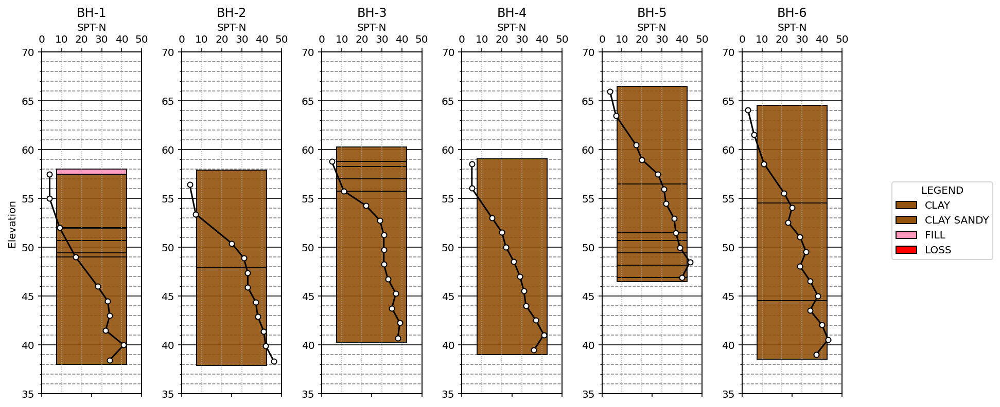

# Borehole Interpreter

Borehole Interpreter is a Python library made for quick data visualization of geotechnical drillholes (boreholes and CPTs). It is targeted towards other geotechnical engineers as a tool of analysis & design.

*Warning*: Still in alpha development

Used tools:
 - Pandas & Numpy
 - Matplotlib
 - SQLite
 - Jupyter Notebook

## Demo

## Use Cases

 - [Getting Started](./notebooks/Understanding%20the%20BoreholeInterpreter%20Object%20Model.md)
 - [Borehole Visualization](./notebooks/Example%20-%20Borehole.md)
 - [CPT Visualization](./notebooks/Example%20-%20CPT.md)
 - [Big Dataset](./notebooks/Advanced%20Example%20Interpreting%20Large%20Data.md)