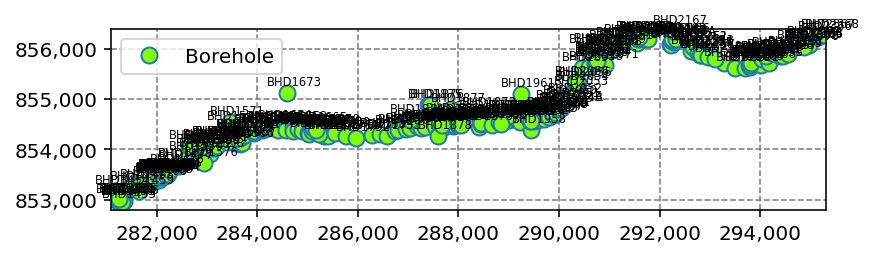

# Advanced Example: Interpreting Large Data

In this example, we'll try using the BoreholeInterpreter package to interpret hundreds of geotechnical points.

The following data is sourced from the National Geoscience Data Centre (NGDC), "<i>A96 Dualling Gollanfield to Auldearn Detailed Ground Investigation</i>"

We'll start by importing the package and opening the example file.


```python
from classes import Project, Borehole, CPT
from examples import open_example

project_1 = open_example('bh_2')
```

To view a summary of the imported points:


```python
project_1.get_list_of_all_points()
```


<div>
<style scoped>
    .dataframe tbody tr th:only-of-type {
        vertical-align: middle;
    }

    .dataframe tbody tr th {
        vertical-align: top;
    }

    .dataframe thead th {
        text-align: right;
    }
</style>
<table border="1" class="dataframe">
  <thead>
    <tr style="text-align: right;">
      <th></th>
      <th>Point ID</th>
      <th>Test Type</th>
      <th>X</th>
      <th>Y</th>
      <th>Elevation</th>
      <th>Hole Depth</th>
    </tr>
  </thead>
  <tbody>
    <tr>
      <th>0</th>
      <td>BHD1450</td>
      <td>Borehole</td>
      <td>281186.50</td>
      <td>852995.10</td>
      <td>29.83</td>
      <td>6.000000</td>
    </tr>
    <tr>
      <th>1</th>
      <td>BHD1451</td>
      <td>Borehole</td>
      <td>281282.16</td>
      <td>852957.57</td>
      <td>30.86</td>
      <td>19.950001</td>
    </tr>
    <tr>
      <th>2</th>
      <td>BHD1452</td>
      <td>Borehole</td>
      <td>281287.52</td>
      <td>852983.94</td>
      <td>29.58</td>
      <td>16.750000</td>
    </tr>
    <tr>
      <th>3</th>
      <td>BHD1453</td>
      <td>Borehole</td>
      <td>281301.35</td>
      <td>852890.07</td>
      <td>32.43</td>
      <td>8.500000</td>
    </tr>
    <tr>
      <th>4</th>
      <td>BHD1454</td>
      <td>Borehole</td>
      <td>281178.25</td>
      <td>853175.40</td>
      <td>25.96</td>
      <td>6.050000</td>
    </tr>
    <tr>
      <th>...</th>
      <td>...</td>
      <td>...</td>
      <td>...</td>
      <td>...</td>
      <td>...</td>
      <td>...</td>
    </tr>
    <tr>
      <th>246</th>
      <td>BHD2366</td>
      <td>Borehole</td>
      <td>295151.99</td>
      <td>856226.65</td>
      <td>48.00</td>
      <td>8.200000</td>
    </tr>
    <tr>
      <th>247</th>
      <td>BHD2367</td>
      <td>Borehole</td>
      <td>295206.04</td>
      <td>856265.32</td>
      <td>46.90</td>
      <td>8.400000</td>
    </tr>
    <tr>
      <th>248</th>
      <td>BHD2368</td>
      <td>Borehole</td>
      <td>295287.44</td>
      <td>856268.60</td>
      <td>46.27</td>
      <td>8.400000</td>
    </tr>
    <tr>
      <th>249</th>
      <td>BHD2369</td>
      <td>Borehole</td>
      <td>294861.70</td>
      <td>856083.56</td>
      <td>48.22</td>
      <td>27.600000</td>
    </tr>
    <tr>
      <th>250</th>
      <td>BHD2370</td>
      <td>Borehole</td>
      <td>294880.11</td>
      <td>856041.19</td>
      <td>49.08</td>
      <td>28.200001</td>
    </tr>
  </tbody>
</table>
<p>251 rows × 6 columns</p>
</div>


To view the overall site plan:


```python
img = project_1.plot_location()
```


    

    


To get a plot of all boreholes:


```python
img = project_1.plot_boreholes(plot_by_el=True)
```


    

    


To define custom styling for specific soil types:


```python
dict_custom_style = {
    "COBBLES and BOULDERS": ('#BCBCBC', ''),   # gray-coloured with solid fill
    "MADE GROUND":          ('#50E73C', ''),   # green-coloured with solid fill
    "CLAY":                 ('#FA9073', ''),   # style clayey soils as pale-red solid fill
    "MUDSTONE":             ('#FA9073', '|'),  # style mudstone as pale-red fill with vertical downwards hatching
}
```


```python
img = project_1.plot_boreholes(plot_by_el=True, style=dict_custom_style)
```


    

    


You can also superimpose the logs with the SPT-N values:


```python
img = project_1.plot_boreholes(plot_by_el=True, superimpose='SPT')
```


    

    

