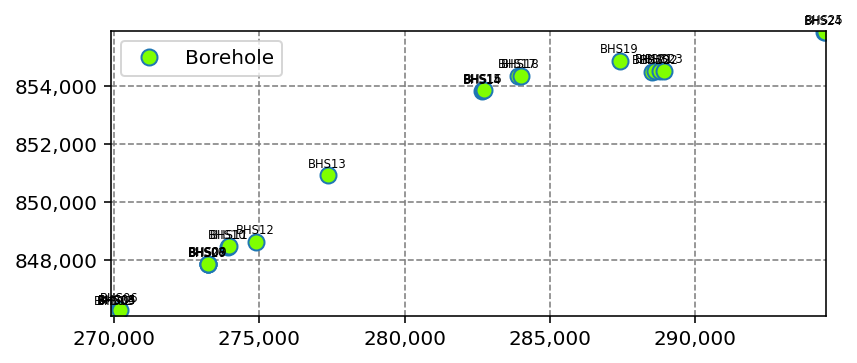
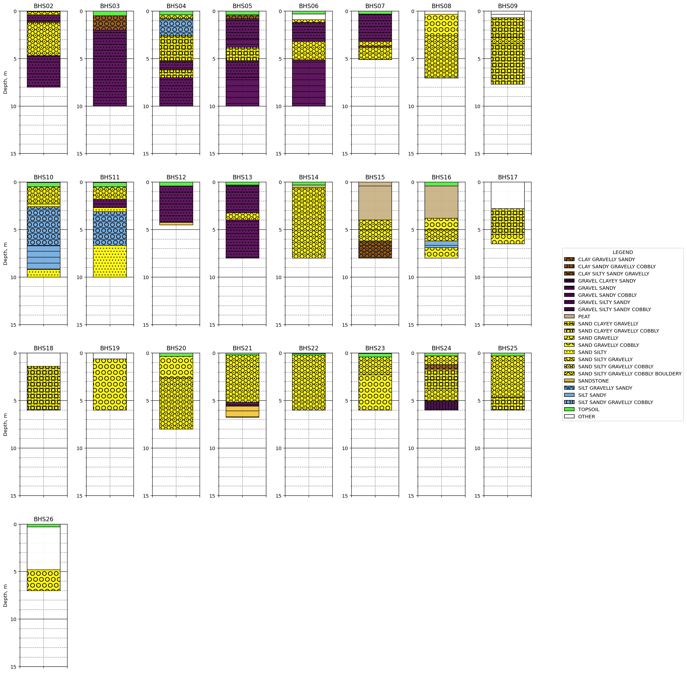
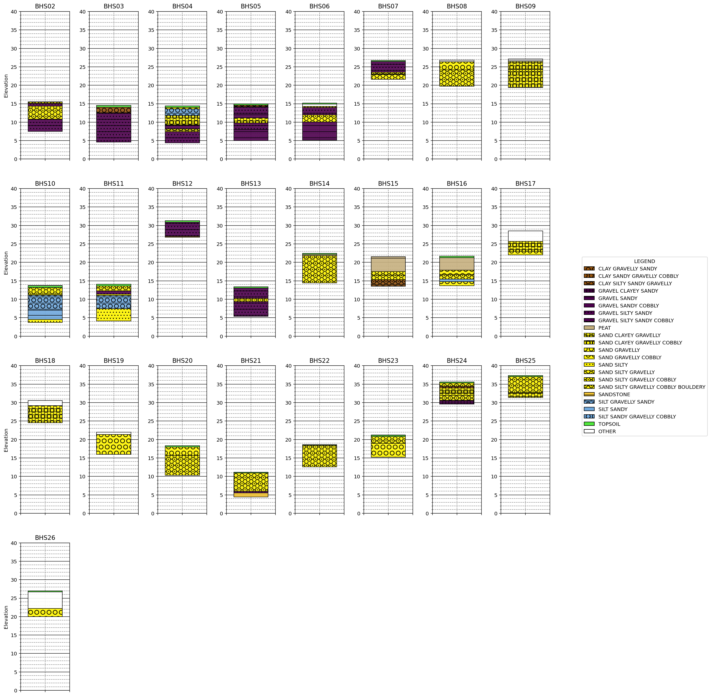
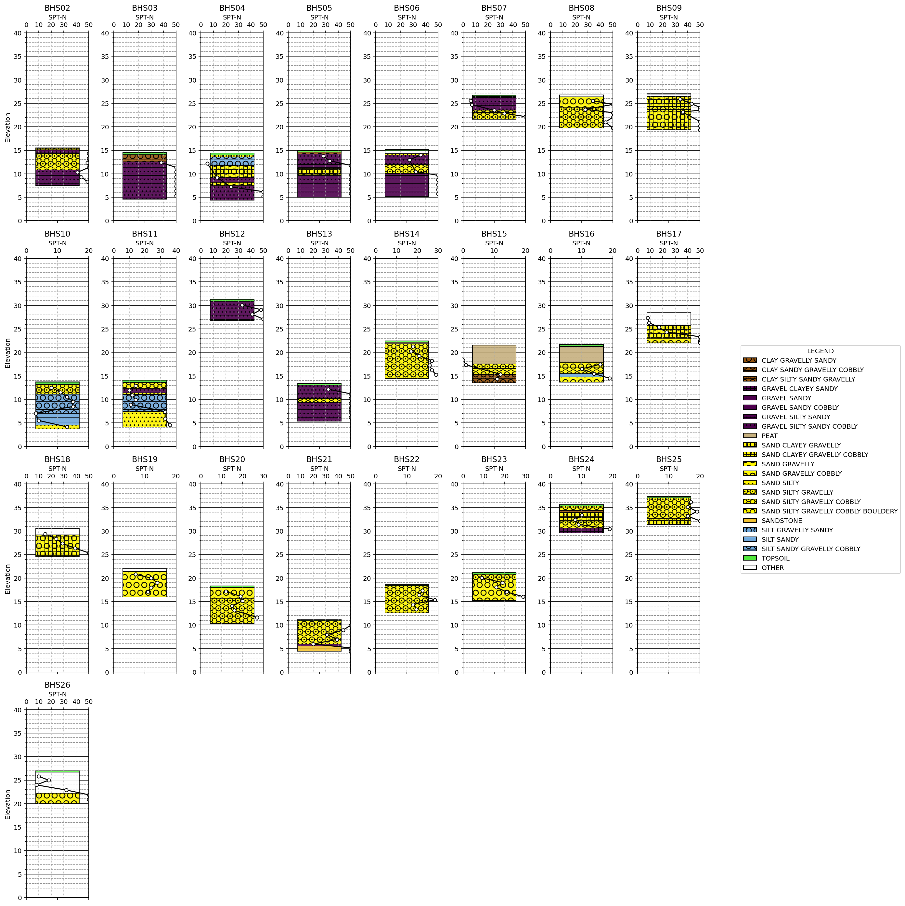

```python
from classes import Project, Borehole, CPT
from examples import open_example
```

# Example 1: Borehole Data Interpretation


```python
project_1 = open_example('bh_1')

project_1.get_list_of_all_points()
```


<div>
<style scoped>
    .dataframe tbody tr th:only-of-type {
        vertical-align: middle;
    }

    .dataframe tbody tr th {
        vertical-align: top;
    }

    .dataframe thead th {
        text-align: right;
    }
</style>
<table border="1" class="dataframe">
  <thead>
    <tr style="text-align: right;">
      <th></th>
      <th>Point ID</th>
      <th>Test Type</th>
      <th>X</th>
      <th>Y</th>
      <th>Elevation</th>
      <th>Hole Depth</th>
    </tr>
  </thead>
  <tbody>
    <tr>
      <th>0</th>
      <td>BHS02</td>
      <td>Borehole</td>
      <td>269979.04</td>
      <td>846193.94</td>
      <td>15.53</td>
      <td>8.00</td>
    </tr>
    <tr>
      <th>1</th>
      <td>BHS03</td>
      <td>Borehole</td>
      <td>270105.04</td>
      <td>846203.10</td>
      <td>14.58</td>
      <td>10.00</td>
    </tr>
    <tr>
      <th>2</th>
      <td>BHS04</td>
      <td>Borehole</td>
      <td>270114.00</td>
      <td>846222.98</td>
      <td>14.40</td>
      <td>10.00</td>
    </tr>
    <tr>
      <th>3</th>
      <td>BHS05</td>
      <td>Borehole</td>
      <td>270137.00</td>
      <td>846237.05</td>
      <td>14.99</td>
      <td>10.00</td>
    </tr>
    <tr>
      <th>4</th>
      <td>BHS06</td>
      <td>Borehole</td>
      <td>270193.64</td>
      <td>846298.66</td>
      <td>15.18</td>
      <td>10.00</td>
    </tr>
    <tr>
      <th>5</th>
      <td>BHS07</td>
      <td>Borehole</td>
      <td>273219.93</td>
      <td>847872.08</td>
      <td>26.72</td>
      <td>5.10</td>
    </tr>
    <tr>
      <th>6</th>
      <td>BHS08</td>
      <td>Borehole</td>
      <td>273227.02</td>
      <td>847874.03</td>
      <td>26.76</td>
      <td>7.05</td>
    </tr>
    <tr>
      <th>7</th>
      <td>BHS09</td>
      <td>Borehole</td>
      <td>273247.03</td>
      <td>847873.94</td>
      <td>27.12</td>
      <td>7.70</td>
    </tr>
    <tr>
      <th>8</th>
      <td>BHS10</td>
      <td>Borehole</td>
      <td>273908.00</td>
      <td>848465.02</td>
      <td>13.71</td>
      <td>10.00</td>
    </tr>
    <tr>
      <th>9</th>
      <td>BHS11</td>
      <td>Borehole</td>
      <td>273969.00</td>
      <td>848490.99</td>
      <td>14.11</td>
      <td>10.00</td>
    </tr>
    <tr>
      <th>10</th>
      <td>BHS12</td>
      <td>Borehole</td>
      <td>274868.28</td>
      <td>848637.36</td>
      <td>31.29</td>
      <td>4.50</td>
    </tr>
    <tr>
      <th>11</th>
      <td>BHS13</td>
      <td>Borehole</td>
      <td>277370.96</td>
      <td>850931.06</td>
      <td>13.38</td>
      <td>8.00</td>
    </tr>
    <tr>
      <th>12</th>
      <td>BHS14</td>
      <td>Borehole</td>
      <td>282683.02</td>
      <td>853830.96</td>
      <td>22.46</td>
      <td>8.00</td>
    </tr>
    <tr>
      <th>13</th>
      <td>BHS15</td>
      <td>Borehole</td>
      <td>282694.00</td>
      <td>853861.93</td>
      <td>21.55</td>
      <td>8.00</td>
    </tr>
    <tr>
      <th>14</th>
      <td>BHS16</td>
      <td>Borehole</td>
      <td>282726.01</td>
      <td>853857.93</td>
      <td>21.69</td>
      <td>8.00</td>
    </tr>
    <tr>
      <th>15</th>
      <td>BHS17</td>
      <td>Borehole</td>
      <td>283903.92</td>
      <td>854361.82</td>
      <td>28.53</td>
      <td>6.50</td>
    </tr>
    <tr>
      <th>16</th>
      <td>BHS18</td>
      <td>Borehole</td>
      <td>283998.16</td>
      <td>854366.52</td>
      <td>30.55</td>
      <td>6.00</td>
    </tr>
    <tr>
      <th>17</th>
      <td>BHS19</td>
      <td>Borehole</td>
      <td>287417.70</td>
      <td>854868.66</td>
      <td>21.99</td>
      <td>6.00</td>
    </tr>
    <tr>
      <th>18</th>
      <td>BHS20</td>
      <td>Borehole</td>
      <td>288519.34</td>
      <td>854505.05</td>
      <td>18.32</td>
      <td>8.00</td>
    </tr>
    <tr>
      <th>19</th>
      <td>BHS21</td>
      <td>Borehole</td>
      <td>288617.41</td>
      <td>854525.15</td>
      <td>11.14</td>
      <td>6.75</td>
    </tr>
    <tr>
      <th>20</th>
      <td>BHS22</td>
      <td>Borehole</td>
      <td>288807.36</td>
      <td>854513.98</td>
      <td>18.57</td>
      <td>6.00</td>
    </tr>
    <tr>
      <th>21</th>
      <td>BHS23</td>
      <td>Borehole</td>
      <td>288952.86</td>
      <td>854531.44</td>
      <td>21.22</td>
      <td>6.00</td>
    </tr>
    <tr>
      <th>22</th>
      <td>BHS24</td>
      <td>Borehole</td>
      <td>294448.29</td>
      <td>855861.75</td>
      <td>35.61</td>
      <td>6.00</td>
    </tr>
    <tr>
      <th>23</th>
      <td>BHS25</td>
      <td>Borehole</td>
      <td>294473.35</td>
      <td>855867.73</td>
      <td>37.35</td>
      <td>6.00</td>
    </tr>
    <tr>
      <th>24</th>
      <td>BHS26</td>
      <td>Borehole</td>
      <td>273227.21</td>
      <td>847866.58</td>
      <td>26.98</td>
      <td>7.00</td>
    </tr>
  </tbody>
</table>
</div>


To view the overall site plan:


```python
img = project_1.plot_location()
```


    

    


To get a plot of all boreholes.


```python
img = project_1.plot_boreholes()
```


    

    


You can also plot the boreholes by elevation.


```python
img = project_1.plot_boreholes(plot_by_el=True)
```


    

    


You can also plot the boreholes with the SPT-N values superimposed over the logs.


```python
img = project_1.plot_boreholes(plot_by_el=True, superimpose='SPT')
```


    

    

