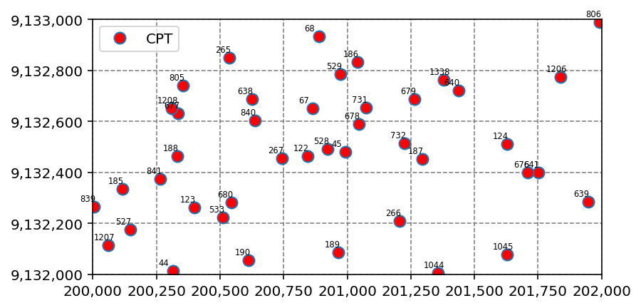
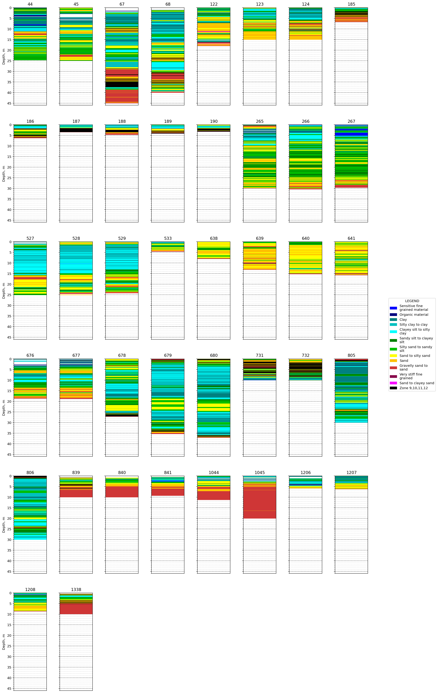
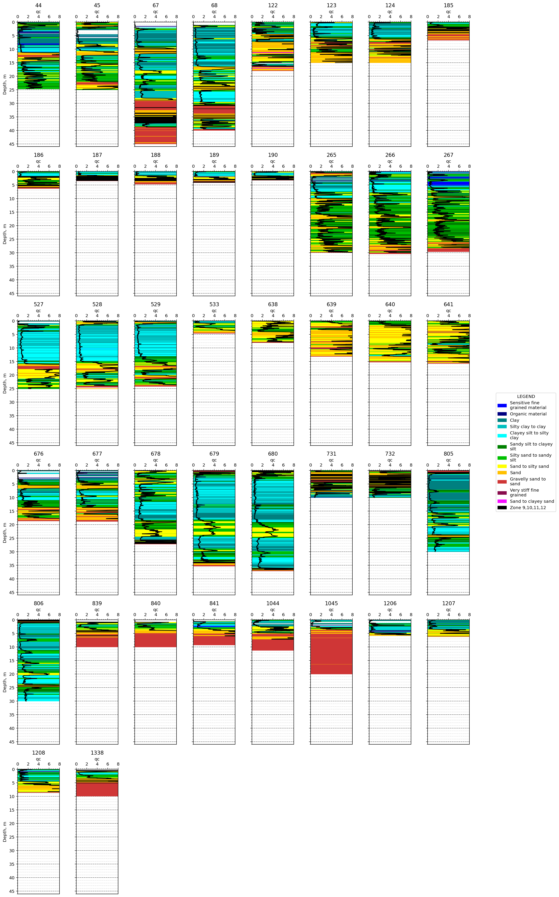
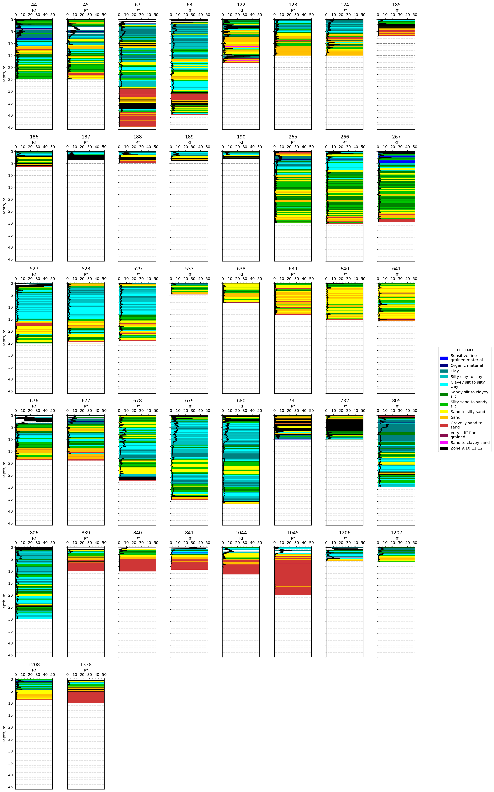
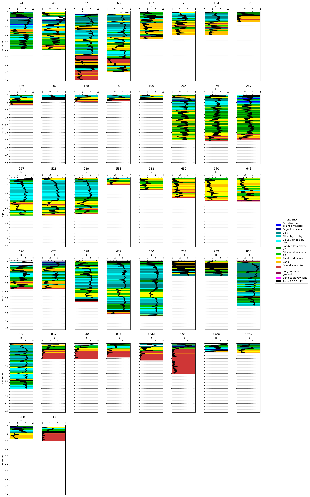
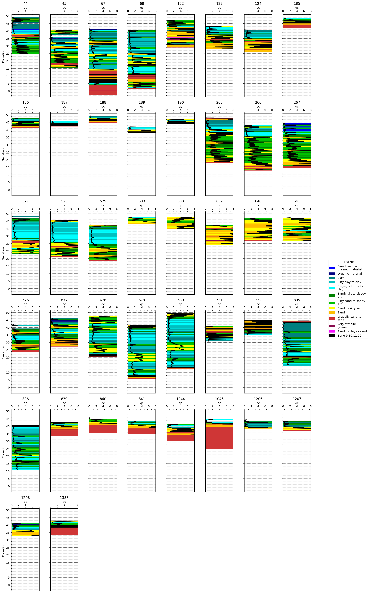

```python
from classes import Project, Borehole, CPT
from examples import open_example
```

## Example 2: CPT Interpretation


```python
project_2 = open_example('cpt_1')

project_2.get_list_of_all_points()
```


<div>
<style scoped>
    .dataframe tbody tr th:only-of-type {
        vertical-align: middle;
    }

    .dataframe tbody tr th {
        vertical-align: top;
    }

    .dataframe thead th {
        text-align: right;
    }
</style>
<table border="1" class="dataframe">
  <thead>
    <tr style="text-align: right;">
      <th></th>
      <th>Point ID</th>
      <th>Test Type</th>
      <th>X</th>
      <th>Y</th>
      <th>Elevation</th>
      <th>Hole Depth</th>
    </tr>
  </thead>
  <tbody>
    <tr>
      <th>0</th>
      <td>44</td>
      <td>CPT</td>
      <td>200315.0</td>
      <td>9132012.0</td>
      <td>49.2</td>
      <td>24.64</td>
    </tr>
    <tr>
      <th>1</th>
      <td>45</td>
      <td>CPT</td>
      <td>200993.0</td>
      <td>9132480.0</td>
      <td>40.6</td>
      <td>24.99</td>
    </tr>
    <tr>
      <th>2</th>
      <td>67</td>
      <td>CPT</td>
      <td>200864.0</td>
      <td>9132651.0</td>
      <td>42.6</td>
      <td>45.00</td>
    </tr>
    <tr>
      <th>3</th>
      <td>68</td>
      <td>CPT</td>
      <td>200888.0</td>
      <td>9132933.0</td>
      <td>41.6</td>
      <td>40.00</td>
    </tr>
    <tr>
      <th>4</th>
      <td>122</td>
      <td>CPT</td>
      <td>200844.0</td>
      <td>9132463.0</td>
      <td>47.1</td>
      <td>18.00</td>
    </tr>
    <tr>
      <th>5</th>
      <td>123</td>
      <td>CPT</td>
      <td>200400.0</td>
      <td>9132261.0</td>
      <td>43.2</td>
      <td>15.00</td>
    </tr>
    <tr>
      <th>6</th>
      <td>124</td>
      <td>CPT</td>
      <td>201628.0</td>
      <td>9132511.0</td>
      <td>40.9</td>
      <td>15.00</td>
    </tr>
    <tr>
      <th>7</th>
      <td>185</td>
      <td>CPT</td>
      <td>200116.0</td>
      <td>9132336.0</td>
      <td>48.8</td>
      <td>6.72</td>
    </tr>
    <tr>
      <th>8</th>
      <td>186</td>
      <td>CPT</td>
      <td>201041.0</td>
      <td>9132834.0</td>
      <td>47.8</td>
      <td>6.30</td>
    </tr>
    <tr>
      <th>9</th>
      <td>187</td>
      <td>CPT</td>
      <td>201295.0</td>
      <td>9132453.0</td>
      <td>45.8</td>
      <td>3.43</td>
    </tr>
    <tr>
      <th>10</th>
      <td>188</td>
      <td>CPT</td>
      <td>200332.0</td>
      <td>9132463.0</td>
      <td>49.4</td>
      <td>4.67</td>
    </tr>
    <tr>
      <th>11</th>
      <td>189</td>
      <td>CPT</td>
      <td>200966.0</td>
      <td>9132085.0</td>
      <td>42.1</td>
      <td>4.09</td>
    </tr>
    <tr>
      <th>12</th>
      <td>190</td>
      <td>CPT</td>
      <td>200613.0</td>
      <td>9132055.0</td>
      <td>47.1</td>
      <td>3.20</td>
    </tr>
    <tr>
      <th>13</th>
      <td>265</td>
      <td>CPT</td>
      <td>200537.0</td>
      <td>9132851.0</td>
      <td>48.2</td>
      <td>29.94</td>
    </tr>
    <tr>
      <th>14</th>
      <td>266</td>
      <td>CPT</td>
      <td>201205.0</td>
      <td>9132208.0</td>
      <td>43.3</td>
      <td>30.36</td>
    </tr>
    <tr>
      <th>15</th>
      <td>267</td>
      <td>CPT</td>
      <td>200743.0</td>
      <td>9132454.0</td>
      <td>44.3</td>
      <td>29.61</td>
    </tr>
    <tr>
      <th>16</th>
      <td>527</td>
      <td>CPT</td>
      <td>200146.0</td>
      <td>9132174.0</td>
      <td>48.2</td>
      <td>25.02</td>
    </tr>
    <tr>
      <th>17</th>
      <td>528</td>
      <td>CPT</td>
      <td>200923.0</td>
      <td>9132492.0</td>
      <td>45.9</td>
      <td>25.01</td>
    </tr>
    <tr>
      <th>18</th>
      <td>529</td>
      <td>CPT</td>
      <td>200973.0</td>
      <td>9132787.0</td>
      <td>42.6</td>
      <td>24.14</td>
    </tr>
    <tr>
      <th>19</th>
      <td>533</td>
      <td>CPT</td>
      <td>200512.0</td>
      <td>9132223.0</td>
      <td>47.7</td>
      <td>4.52</td>
    </tr>
    <tr>
      <th>20</th>
      <td>638</td>
      <td>CPT</td>
      <td>200625.0</td>
      <td>9132688.0</td>
      <td>47.8</td>
      <td>7.99</td>
    </tr>
    <tr>
      <th>21</th>
      <td>639</td>
      <td>CPT</td>
      <td>201947.0</td>
      <td>9132284.0</td>
      <td>42.3</td>
      <td>13.13</td>
    </tr>
    <tr>
      <th>22</th>
      <td>640</td>
      <td>CPT</td>
      <td>201437.0</td>
      <td>9132722.0</td>
      <td>47.1</td>
      <td>15.17</td>
    </tr>
    <tr>
      <th>23</th>
      <td>641</td>
      <td>CPT</td>
      <td>201751.0</td>
      <td>9132400.0</td>
      <td>47.3</td>
      <td>15.70</td>
    </tr>
    <tr>
      <th>24</th>
      <td>676</td>
      <td>CPT</td>
      <td>201710.0</td>
      <td>9132400.0</td>
      <td>42.5</td>
      <td>18.68</td>
    </tr>
    <tr>
      <th>25</th>
      <td>677</td>
      <td>CPT</td>
      <td>200336.0</td>
      <td>9132632.0</td>
      <td>46.2</td>
      <td>18.80</td>
    </tr>
    <tr>
      <th>26</th>
      <td>678</td>
      <td>CPT</td>
      <td>201045.0</td>
      <td>9132589.0</td>
      <td>47.8</td>
      <td>27.18</td>
    </tr>
    <tr>
      <th>27</th>
      <td>679</td>
      <td>CPT</td>
      <td>201264.0</td>
      <td>9132689.0</td>
      <td>41.3</td>
      <td>35.32</td>
    </tr>
    <tr>
      <th>28</th>
      <td>680</td>
      <td>CPT</td>
      <td>200545.0</td>
      <td>9132282.0</td>
      <td>49.5</td>
      <td>37.09</td>
    </tr>
    <tr>
      <th>29</th>
      <td>731</td>
      <td>CPT</td>
      <td>201073.0</td>
      <td>9132654.0</td>
      <td>40.8</td>
      <td>10.00</td>
    </tr>
    <tr>
      <th>30</th>
      <td>732</td>
      <td>CPT</td>
      <td>201226.0</td>
      <td>9132514.0</td>
      <td>45.0</td>
      <td>10.01</td>
    </tr>
    <tr>
      <th>31</th>
      <td>805</td>
      <td>CPT</td>
      <td>200354.0</td>
      <td>9132740.0</td>
      <td>44.5</td>
      <td>30.00</td>
    </tr>
    <tr>
      <th>32</th>
      <td>806</td>
      <td>CPT</td>
      <td>201992.0</td>
      <td>9132989.0</td>
      <td>40.7</td>
      <td>30.00</td>
    </tr>
    <tr>
      <th>33</th>
      <td>839</td>
      <td>CPT</td>
      <td>200004.0</td>
      <td>9132265.0</td>
      <td>43.5</td>
      <td>9.99</td>
    </tr>
    <tr>
      <th>34</th>
      <td>840</td>
      <td>CPT</td>
      <td>200636.0</td>
      <td>9132605.0</td>
      <td>45.8</td>
      <td>10.00</td>
    </tr>
    <tr>
      <th>35</th>
      <td>841</td>
      <td>CPT</td>
      <td>200266.0</td>
      <td>9132374.0</td>
      <td>44.0</td>
      <td>9.21</td>
    </tr>
    <tr>
      <th>36</th>
      <td>1044</td>
      <td>CPT</td>
      <td>201356.0</td>
      <td>9132004.0</td>
      <td>41.3</td>
      <td>11.22</td>
    </tr>
    <tr>
      <th>37</th>
      <td>1045</td>
      <td>CPT</td>
      <td>201628.0</td>
      <td>9132077.0</td>
      <td>44.9</td>
      <td>20.00</td>
    </tr>
    <tr>
      <th>38</th>
      <td>1206</td>
      <td>CPT</td>
      <td>201838.0</td>
      <td>9132775.0</td>
      <td>44.4</td>
      <td>5.79</td>
    </tr>
    <tr>
      <th>39</th>
      <td>1207</td>
      <td>CPT</td>
      <td>200061.0</td>
      <td>9132114.0</td>
      <td>43.2</td>
      <td>6.18</td>
    </tr>
    <tr>
      <th>40</th>
      <td>1208</td>
      <td>CPT</td>
      <td>200309.0</td>
      <td>9132652.0</td>
      <td>41.2</td>
      <td>8.60</td>
    </tr>
    <tr>
      <th>41</th>
      <td>1338</td>
      <td>CPT</td>
      <td>201379.0</td>
      <td>9132762.0</td>
      <td>43.3</td>
      <td>9.86</td>
    </tr>
  </tbody>
</table>
</div>


To view the overall site plan:


```python
img = project_2.plot_location()
```


    

    


To calculate the CPT parameters:


```python
project_2.calculate_CPT_parameters(
    area_ratio=0.81, 
    unit_weight=16, 
    shared_gwl_depth=0, 
    soil_classification_method='Robertson et al 1986'
)
```

To plot the interpreted soil type of each CPT point:


```python
img = project_2.plot_CPT()
```


    

    


You can also superimpose this plot with each CPT point's cone penetration data:


```python
img = project_2.plot_CPT(superimpose='qc')
```


    

    


You have a choice between the cone penetration (qc & qt), sleeve friction (fs), pore pressure behind tip (u2), friction ration (Rf), pore pressure ratio (Bq), normalized cone penetration (Qt), normalized sleeve friction (Fr), and soil behaviour index (Ic) to superimpose on each log.


```python
img = project_2.plot_CPT(superimpose='Rf')
```


    

    


```python
img = project_2.plot_CPT(superimpose='Ic')
```


    

    


You can also choose to plot each CPT point by elevation:


```python
img = project_2.plot_CPT(plot_by_el=True, superimpose='qc')
```


    

    

